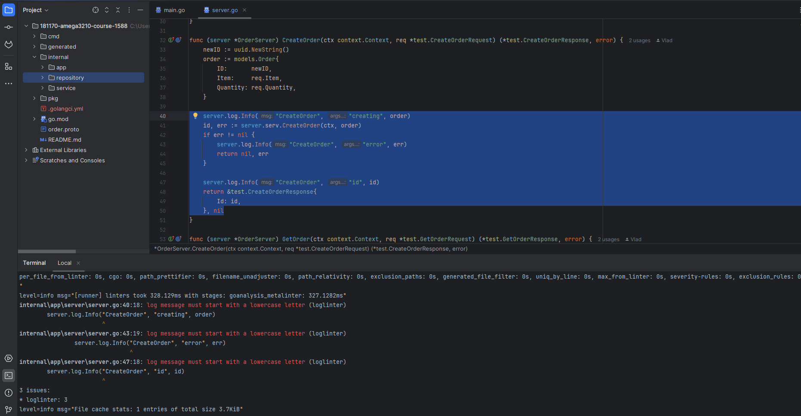
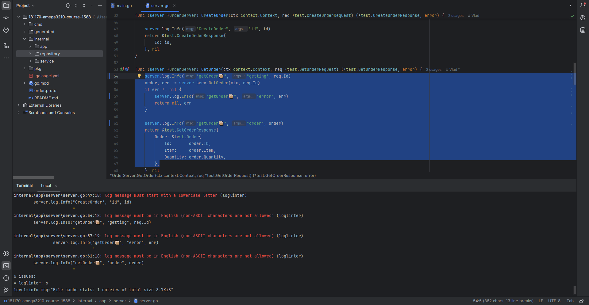

# go-log-linter (loglinter)

Кастомный линтер для Go (Go 1.25+), совместимый с **golangci-lint**. Линтер анализирует
лог-вызовы `log/slog` и `go.uber.org/zap` и проверяет сообщения на соответствие правилам.

Поддерживается запуск на Windows / Linux / macOS

## Что проверяет
Правила:

1. Сообщение должно начинаться со строчной буквы  
   Пример: `slog.Info("starting server")`

2. Сообщение должно быть на английском языке  
   В текущей реализации: запрещены non-ASCII символы (например кириллица/эмодзи).

3. Сообщение не должно содержать спецсимволы/эмодзи  
   Проверяется по whitelist (разрешённый набор символов).

4. Сообщение не должно содержать потенциально чувствительные данные  
   Проверка по ключевым словам: `password`, `api_key`, `token`, `secret`, и т.п.

## Установка

### 1) Установить golangci-lint

#### [Как установить golangci-lint](https://golangci-lint.run/docs/welcome/install/local/)
#### Проверка
```text
golangci-lint --version
```

### 2) Клонировать репозиторий линтера

```powershell
git clone https://github.com/impeaone/go-log-linter
cd go-log-linter
```

## Сборка custom-golangci-lint с loglinter
### ```loglinter``` подключается как module plugin, поэтому для запуска нужен custom binary ```golangci-lint```, собранный командой ```golangci-lint custom```.
### 1) Конфиг сборки ```.custom-gcl.yml```
#### В корне репозитория должен быть файл ```.custom-gcl.yml```
```text
version: v2.10.1
plugins:
  - module: 'github.com/impeaone/go-log-linter'
    import: 'github.com/impeaone/go-log-linter/plugin'
```
### 2) go.work
#### Если вы хотите код линтера локально и хотите, чтобы custom-gcl собирался именно из ваших исходников, создайте workspace:
```text
go work init
go work use .
```
#### Примечание: ```go.work``` влияет на резолв зависимостей. Обычно его не коммитят и добавляют в ```.gitignore```

### 3) Сборка
```powershell
golangci-lint custom -v
```
#### Результат: в корне появится ```custom-gcl.exe``` (Windows) или ```custom-gcl``` (Linux/macOS).

## Как использовать в своем проекте
### 1) Убедитесь, что запускаете именно custom-gcl
#### Пример (Windows):
```powershell
C:\path\to\custom-gcl.exe --version
```

### 2) Добавить конфиг ```.golangci.yml``` в целевой проект
#### В корне проекта, который нужно "линтить", создайте ```.golangci.yml```
```text
version: "2"

linters:
  default: none
  enable:
    - loglinter

  settings:
    custom:
      loglinter:
        type: module
        description: "Log message rules"
        settings:
          requireLowercaseStart: true
          englishMode: "ascii"
          forbidSpecialChars: true
          allowedCharsRegex: "^[a-zA-Z0-9 ,.:?'_-]+$"
          forbidSensitive: true
          sensitiveKeywords:
            - apikey
            - token
            - credential
          sensitivePatterns:
            - '(?i)authorization:\s*bearer\s+[a-z0-9\-._~+/]+=*'
```
### 3) Запустить линтер
#### Важно: ```-c .golangci.yml``` читается относительно текущей директории, поэтому необходимо запускать из корня проекта или указывать абсолютный путь.
```powershell
C:\path\to\custom-gcl.exe run -v -c .golangci.yml .\...     # Windows
# или
/path/to/custom-gcl run -v -c .golangci.yml ./...           # Linux/macOS
```
### Опции конфигурации (пример лежит в репозитории: ```.example.golangci.yml```)
<div align="center">

| Опция                 | Тип       | По умолчанию                 | Описание                                                                      |
|-----------------------|-----------|------------------------------|-------------------------------------------------------------------------------|
| requireLowercaseStart | bool      | true                         | Требовать, чтобы сообщение начиналось со строчной буквы                       | 
| englishMode           | string    | ```ascii```                  | Режим “английского”: сейчас ```ascii```/```latin``` (оба запрещают non-ASCII) | 
| forbidSpecialChars    | bool      | true                         | Запрещать символы вне ```allowedCharsRegex```                                 | 
| allowedCharsRegex     | string    | ```^[a-zA-Z0-9 ,.:?'_-]+$``` | Разрешённые символы, используется если ```forbidSpecialChars=true```          |
| forbidSensitive       | bool      | true                         | Включить проверку на чувствительные данные                                    |
| sensitiveKeywords     | []string  | (в DefaultConfig)            | Ключевые слова (case-insensitive substring match)                             |
| sensitivePatterns     | []string  | ```[]```                     | Regexp паттерны (любое совпадение => sensitive)                               |
</div>

## Примеры “плохих” логов
### log/slog
```go
import "log/slog"

func demo() {
    slog.Info("Starting server")    // заглавная буква
    slog.Info("запуск сервера")     // не английский
    slog.Info("server started!🚀")  // non-ASCII/эмодзи
    slog.Debug("api_key=123")       // чувствительные данные
}
```
### zap
```go
import "go.uber.org/zap"

func demoZap() {
    logger, _ := zap.NewProduction()

    logger.Info("Starting server")     // заглавная буква
    logger.Error("ошибка подключения") // не английский
    logger.Warn("connection failed!!!")// спецсимволы
    logger.Debug("user password: 123") // sensitive keyword
}
```

### Примеры на реальном проекте:
| Пример 1                                      | Пример 2                                      |
|-----------------------------------------------|-----------------------------------------------|
|  |  |
